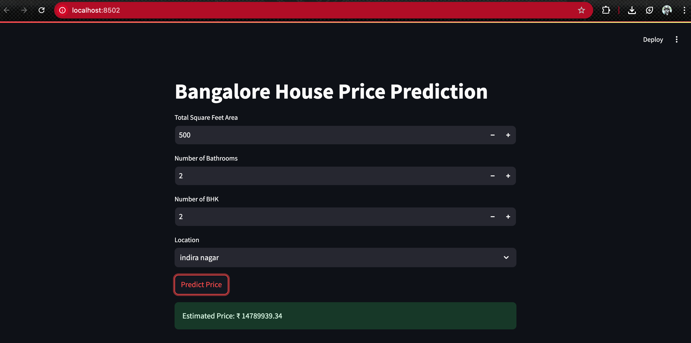

# Bangalore House Price Prediction

This project is a machine learning application that predicts house prices in Bangalore based on various features such as total square feet area, number of bathrooms, number of bedrooms (BHK), and location. The model is trained using a linear regression algorithm and the frontend is built using Streamlit for easy interaction.

## Project Structure

- `House_price_prediction.ipynb`: Jupyter notebook containing data exploration, preprocessing, model training, and evaluation.
- `bangalore_home_prices_model.pickle`: Pickle file containing the trained linear regression model.
- `columns.json`: JSON file containing the list of feature columns used in the model.
- `app.py`: Streamlit application that serves as the frontend for predicting house prices.
- `Screenshot 2025-09-17 at 11.37.52 PM`: Screenshot showing the Streamlit app interface.

## How to Run

1. Make sure you have Python 3.7+ installed.

2. Install the required dependencies:
   ```bash
   pip install -r requirements.txt
   ```
   If `requirements.txt` is not present, install manually:
   ```bash
   pip install streamlit numpy pandas scikit-learn
   ```

3. Run the Streamlit app:
   ```bash
   streamlit run app.py
   ```

4. The app will open in your default browser at `http://localhost:8501`. Use the input fields to enter property details and get the predicted price.

## Features

- Input fields for:
  - Total square feet area
  - Number of bathrooms
  - Number of bedrooms (BHK)
  - Location (select from available Bangalore localities)
- Predicts house price in Indian Rupees (₹)
- Easy-to-use web interface powered by Streamlit

## Model Details

- Model Type: Linear Regression
- Trained on cleaned and preprocessed Bangalore housing data
- Handles location encoding via one-hot encoding

## Screenshot



## Notes

- The model and columns files must be in the same directory as `app.py`.
- The location list is derived from the training data and is fixed in `columns.json`.

## License

This project is open source and free to use.
